	Git 之旅

## 相关知识目录：

1. 基本的命令行方法
2. SSH的连接使用
3. Git 的抽象知识
4. Git 的基本命令
5. Git 的拓展工具
6. Git 的一些注意事项

### 基本的命令行方法

#### CMD

##### 如何打开 CMD 命令提示符窗口

- **方法一：**开始菜单 -> Windows 系统 -> 命令提示符。
- **方法二：**按下快捷键 Win + R 打开运行，输入 cmd 回车。
- **方法三：**点击任务栏搜索按钮，搜索 cmd 并打开。
- **方法四：**在资源管理器的地址栏输入 cmd 并回车，cmd 打开后会自动定位到当前目录。
- **方法五：**右键点击开始菜单的 Win 图标 -> 命令提示符。

**小技巧：**

- 输入 `help`，查看帮助；
- Tab 键，自动补全；
- 上/下方向键，查看历史命令；
- 右键窗口标题栏 -> 属性，可以修改外观样式。


##### 关机、重启、注销、休眠、定时

* 关机：`shutdown /s`

- 重启：`shutdown /r`
- 注销：`shutdown /l`
- 休眠：`shutdown /h /f`
- 取消关机：`shutdown /a`
- 定时关机：`shutdown /s /t 3600`（3600 秒后关机）

##### 目录操作

**切换目录，进入指定文件夹：**

- 切换磁盘：`d:`（进入 d 盘）
- 切换磁盘和目录：`cd /d d:/test`（进入 d 盘 test 文件夹）
- 进入文件夹：`cd \test1\test2`（进入 test2 文件夹）
- 返回根目录：`cd \`
- 回到上级目录：`cd ..`
- 新建文件夹：`md test`

##### 显示目录内容

- 显示目录中文件列表：`dir`
- 显示目录结构：`tree d:\test`（d 盘 test 目录）
- 显示当前目录位置：`cd`
- 显示指定磁盘的当前目录位置：`cd d:`

##### 网络操作

- 延迟和丢包率：`ping ip/域名`
- Ping 测试 5 次：`ping ip/域名 -n 5`
- 清除本地 DNS 缓存：`ipconfig /flushdns`
- 路由追踪：`tracert ip/域名`

##### 进程/服务操作

###### 进程管理

- 显示当前正在运行的进程：`tasklist`
- 运行程序或命令：`start 程序名`
- 结束进程，按名称：`taskkill /im notepad.exe`（关闭记事本）
- 结束进程，按 PID：`taskkill /pid 1234`（关闭 PID 为 1234 的进程）

###### 服务管理

- 显示当前正在运行的服务：`net start`
- 启动指定服务：`net start 服务名`
- 停止指定服务：`net stop 服务名`

##### 文件操作

* ren [盘符:] [路径] <源文件名> <目标文件名>
文件重命名

* type命令
用法：type: [盘符] [路径]<文件名>
作用：在命令提示符窗口中查看文件的具体内容
* <commond>  >> <文件名>
追加式文件写入
* <commond>  > <文件名>
覆盖式文件写入
* touch <文件名>
创建空文件
#### Linux (Shell)

##### Shell可以执行

- **内部命令**
- **应用程序**
- **shell脚本**
- **命令行解释(这是用得最多的！)**

##### Shell 可以干的事
- 命令的多种执行顺序
- 通配符（ wild-card characters ）
- 命令补全、别名机制、命令历史
- I/O重定向（ Input/output redirection ）
- 管道（ pipes ）
- 命令替换（ 或$( ) ）
- Shell编程语言（ Shell Script ）

##### 命令基本格式

`cmd [options] [arguments]`，options称为选项，arguments称为参数

选项和参数都作为Shell命令执行时的输入，它们**之间用空格分隔开**。

- Linux是**区分大小**写的

**一般来说**，后面跟的选项如果**单字符**选项前使用**一个**`减号-`。**单词选项**前使用两个`减号--`

- 这是一般的情况，有些命令还是不归属这种规律的(相对较少)~~~
- 例子：`ls -a`和`ls -all`，`a` 单个字符使用一个`-`，一个单词`all` 使用两个`--`

在Linux中，**可执行的文件**也进行了分类：

- **内置命令**：出于效率的考虑，将一些常用命令的解释程序**构造在Shell内部**。
- **外置命令**：存放在/bin、/sbin目录下的命令
- **实用程序**：存放在/usr/bin、/usr/sbin、/usr/share、/usr/local/bin等目录下的实用程序
- **用户程序**：用户程序经过编译生成可执行文件后，可作为Shell命令运行
- **Shell脚本**：由Shell语言编写的批处理文件，可作为Shell命令运行

##### 通配符

学过一些正则表达式的或者有点基础的同学对通配符应该就不陌生的了，在Linux也有通配符(在搜索的时候挺有用的)

- *：匹配任何字符和任何数目的字符
- ?：匹配单一数目的任何字符
- [ ]：匹配[ ]之内的任意一个字符
- [! ]：匹配除了[! ]之外的任意一个字符，!表示非的意思

##### 常用的文件、目录操作命令

这是我们**使用得最多**的命令了，**Linux最基础的命令**！

- 可用 `pwd`命令查看用户的当前目录
- 可用 `cd` 命令来切换目录
- `.`表示当前目录
- `..` 表示当前目录的上一级目录（父目录）
- `-`表示用 cd 命令切换目录**前**所在的目录
- `~` 表示**用户主目录**的绝对路径名

**绝对路径：**

- 以斜线（/）开头 ，描述到文件位置的**完整说明** ，任何时候你想指定文件名的时候都可以使用

**相对路径 ：**

- 不以斜线（/）开头 ，指定**相对于你的当前工作目录而言的位置** ，可以被用作指定文件名的简捷方式

> tips:**输入命令的时候要常用tab键来补全**

- `ls`：显示文件或目录信息
- `mkdir`：当前目录下创建一个空目录
- `rmdir`：要求目录为空
- `touch`：生成一个空文件或更改文件的时间
- `cp`：复制文件或目录
- `mv`：移动文件或目录、文件或目录改名
- `rm`：删除文件或目录
- `ln`：建立链接文件
- `find`：查找文件
- `file/stat`：查看文件类型或文件属性信息
- `cat：`查看文本文件内容
- `more：`可以分页看
- `less：`不仅可以分页，还可以方便地搜索，回翻等操作
- `tail -10`： 查看文件的尾部的10行
- `head -20`：查看文件的头部20行
- `echo`：把内容重定向到指定的文件中 ，有则打开，无则创建
- `管道命令 |` ：将前面的结果给后面的命令，例如：`ls -la | wc`，将ls的结果加油wc命令来统计字数
- `重定向 > 是覆盖模式，>> 是追加模式`，例如：`echo "Java3y,zhen de hen xihuan ni" > qingshu.txt`把左边的输出放到右边的文件里去

学了这些命令我们能干嘛？**其实就是在Windows下复制文件、粘贴文件、创建文件、查看文件这几种**~~~

###### 常用的文件、目录操作练习

- （1）Linux的shell程序默认是`bash 程序`；
- （2）Linux命令格式包含三个部分，分别是： `命令` 、 `选项` 、 `参数` ；
- （3）Linux命令选项前为单个减号（-），后面一般为 `单字符` ，选项前为双减号（--），后面一般为 `单词`；
- （4）Linux命令中使用的通配符有 `？ * []` ；
- （5）命令 ls /usr/bin/w* 的效果是 `列出指定目录下的所有以w开头的文件或目录` ；
- （6）命令 ls /usr/bin/w?? 的效果是 `列出指定目录下的以w开头名称长度为3的所有文件或目录` ；
- （7）命令 ls /usr/bin/[xyz]* 的效果是 `列出指定目录下的文件名以x或y或z开头的所有文件或目录` ；
- （8）命令 ls /usr/bin/[!a-h]* 的效果是 `列出指定目录下的文件名不以a到h区间字母开头的所有文件或目录` ；
- （9）目录操作时，“.” 表示 `当前目录` ；
- （10）目录操作时，“..” 表示 `上一级目录` ；
- （11）目录操作时，“-” 表示 `上一次工作目录` ；
- （12）目录操作时，“~” 表示 `用户主目录` ；
- （13）命令ln可以建立文件链接，这种链接分为： `硬链接` 和 `软链接` ；
- （14）命令touch可以改变文件的三种时间，分别是： `access time` 、 `modify time` 、 `change time` ；

##### 文件打包和压缩命令

在Windows操作系统下，我们会使用WinRAR或者快压等等的压缩软件来进行压缩或者解压。

在Linux下**当然也存在压缩或解压的操作咯**，下面我们就来学习一下在Linux下是怎么压缩和解压的！

| 命令      | 功能                              |
| --------- | --------------------------------- |
| xz        | 使用LZMA算法的高性能压缩/解压工具 |
| gzip      | 流行的GNU gzip 数据压缩/解压程序  |
| bzip2     | 免费的,无专利的高性能数据压缩工具 |
| zip/unzip | 与WinZIP兼容的压缩/解压工具       |
| rar       | 与WinRAR兼容的压缩/解压工具       |
| 7za       | 使用LZMA算法的高性能压缩/解压工具 |
| tar       | 文件打包、归档工具                |


| 文件后缀 | 说明                              |
| --------- | --------------------------------- |
| .bz2    | 用bzip2压缩的文件 |
| .gz   | 用gzip压缩的文件 |
| .xz  | 用xz压缩的文件 |
| .tar | 用tar打包的文件，也称tar文件 |
| .tbz   | tar打包时用bzip2压缩的文件 |
| .tgz   | tar 打包时用gzip压缩的文件 |
| .zip   | 用zip/winzip压缩的文件 |
|.rar|用rar压缩的文件|
|.7z|用7za压缩的文件|

压缩的方式也是有好几种，我们**常用**的有下面这三种：

- gzip
- bzip2
- tar

常用的压缩的命令就有：

- `gzip filename`
- `bzip2 filename`
- `tar -czvf filename`

常用的解压命令有：

- `gzip -d filename.gz`
- `bzip2 -d filename.bz2`
- `tar -xzvf filename.tar.gz`

##### 正则表达式+grep

上面我们已经学过了`cat、more、less、tail`这些查看文本文件的命令了，但是我想**快速查看这个文本文件下的某些关键字是否存在**，那怎么办？？？

在Windows下就比较简单的，几乎所有的文本编辑器(记事本)都支持`CTRL+F`，往里面输入关键字就可查找出来：

那在Linux下，没有图形界面，没有`CTRL+F`的情况下，**如果不懂一些命令的话，那还真是难找对应的字符出来**。下面我就来说说如何快速**查找一个文本文件下的某些字符**。

###### 正则表达式

首先我们就来说说正则表达式，如果接触过的同学就知道：这玩意并不好记。一旦不用就很容易就忘记了，所以只能在用的时候查查了~~~所以下面我就直接给出一些规则了，不多说啦。


###### grep命令

grep(global search regular expression)是一个**强大的文本搜索工具**。grep 使用正则表达式搜索文本，并把匹配的行打印出来。

格式：`grep [options] PATTERN [FILE...]`

- PATTERN 是查找条件：**可以是普通字符串、可以是正则表达式**，通常用单引号将RE括起来。
- FILE 是要查找的文件，可以是用空格间隔的多个文件，也可是使用Shell的通配符在多个文件中查找PATTERN，省略时表示在标准输入中查找。
- grep命令不会对输入文件进行任何修改或影响，可以使用输出重定向将结果存为文件

例子：

- 在文件 myfile 中查找包含字符串 mystr的行

- - `grep -n mystr myfile`

- 显示 myfile 中第一个字符为字母的所有行

- - `grep '^[a-zA-Z]' myfile`

- 在文件 myfile 中查找首字符不是 # 的行（**即过滤掉注释行**）

- - `grep -v '^#' myfile`

- 列出/etc目录（包括子目录）下所有文件内容中包含字符串“root”的文件名

- - `grep -lr root /etc/*`


> 用grep查找/etc/passwd文件中以a开头的行，要求显示行号；查找/etc/passwd文件中以login结束的行；


###### 几种提高工作效率的方法

- **自动补全命令**

- - TAB键

- **历史命令**

- - 上下箭头键

- **别名alias**

这里感觉要说说的就只有别名alias了，我们下面看看例子就懂了！

> 显示shell当前已经定义的别名；执行其中的两个定义别名的命令；定义一个别名grep，要求其采用彩色方式显示结果


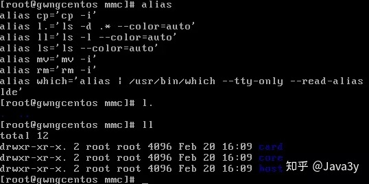


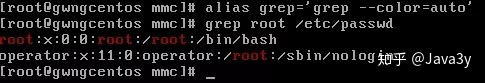


###### Shell变量 和 Shell环境

在Windows下有用户的环境变量，系统的环境变量。在Linux一样也是有的。

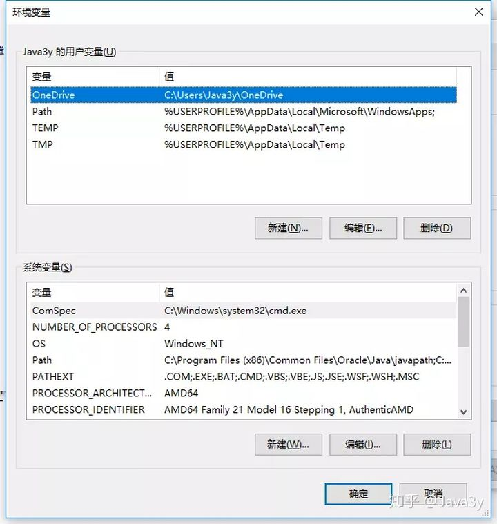

Shell 变量大致可以**分为三类**：

- **内部变量**：由系统提供，用户只能使用不能修改。

- - ?
- GROUPS

- **环境变量**：这些变量决定了用户工作的环境，它们不需要用户去定义，可以直接在 shell 中使用，其中某些变量用户可以修改。

- **用户变量**：由用户建立和修改，在 shell 脚本编写中会经常用到。

- - 变量赋值（定义变量）

- - `varName=Value`
- `export varName=Value`

- 引用变量`$varName`

Shell变量的**作用域**：

- **局部变量**的作用范围仅仅**限制在其命令行所在的Shell或Shell脚本文件中**；
- **全局变量**的作用范围则包括**本Shell进程及其所有子进程**。
- 局部变量与全局变量**互换**：可以使用 `export` 内置命令将局部变量设置为全局变量。 可以使用 `export` 内置命令将全局变量设置为局部变量。

**export命令**：

- **显示**当前Shell可见的全局变量

- - `export [-p]`

- **定义变量值的同时声明为全局变量**。

- - `export <变量名1=值1> [<变量名2=值2> ...]`

- 声明已经赋值的某个（些）**局部变量为全局变量**。

- - `export <变量名1> [<变量名2> ...]`

- 声明已经赋值的某个（些）**全局变量为局部变量**。

- - `export -n <变量名1> [<变量名2> ...]`

Shell环境变量：

- 环境变量定义 Shell 的**运行环境**，保证 Shell 命令的正确执行。
- Shell用环境变量来确定查找路径、注册目录、终端类型、终端名称、用户名等。
- 所有环境变量**都是全局变量**（即可以传递给 Shell 的子进程），并可以由用户重新设置。


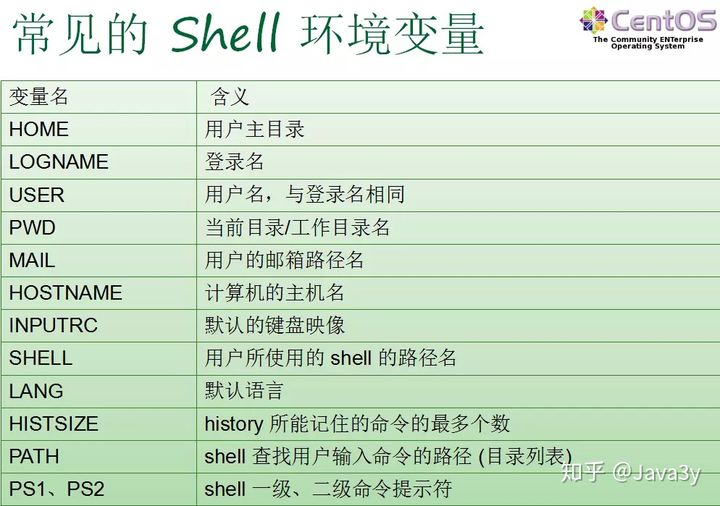


**Shell变量：查询、显示和取消**：

- 显示当前已经定义的所有变量

- - 所有**环境变量**：`env`
- 所有**变量和函数**（包括环境变量） ：`set`

- 显示某（些）个变量的值

- - `echo $NAME1 [$NAME2 ……]`

- 取消变量的声明或赋值

- - `unset <NAME>`


> Shell环境变量的值是否可以修改？为什么？

答：环境变量的值一般情况下，可以修改。但一定要**慎重修改**，因为一旦修改错误，对shell正常运行造成严重影响，甚至导致shell无法运行。

### SSH的连接使用

#### SSH 介绍

Secure Shell，又可记为安全外壳协议（SSH），最初是UNIX系统上的一个程序，后来又迅速扩展到其他操作平台，是一种在不安全网络上提供安全远程登录及其它安全网络服务的协议，SSH协议可以用来进行远程控制，或在计算机之间传送文件。而实现此功能的传统方式，如telnet(终端仿真协议)、 rcp ftp、rlogin、rsh都是极为不安全的，并且会使用明文传送密码。

SSH是一个好的应用程序，在正确使用时，它可以弥补网络中的漏洞。除此以外， SSH之所以流行，还有以下更关键原因：

1.SSH客户端适用于多种平台。

2.对非商业用途它是免费的。

3.通过SSH可以把传输的数据进行加密，防止“中间人（man-in-the-middle）”攻击，还能防止DNS和IP欺骗，同时SSH能够对数据进行压缩，可以加快传输的数据速度，甚至可以为ppp提供一个安全的“通道”。

4.UNIX版本提供了源代码，这意味着任何人都可以对它进行修改或b u g修补来提高其性能，甚至还可以增加功能，而我们现在linux中常用openssh的就是ssh的免费开源版本。（以下内容提到的SSH工具是OpenSSH）


OpenSSH服务，sshd，是一个典型的独立守护进程(standalone daemon)，但也可以根据需要通过网络守护进程(Internet Daemon)-inetd或Ineternet Daemon's more modern-xinted加载。OpenSSH服务可以通过/etc/ssh/sshd_config文件进行配置。OpenSSH提供了服务端后台程序和客户端，用来加密远程控制和文件传输过程中的数据，并由此来代替原来的类似服务，各自功能如下：

> 服务端：它是一个守护进程(demon)，他在后台运行并响应来自客户端的连接请求。服务端一般是sshd进程，提供了对远程连接的处理，一般包括公共密钥认证、密钥交换、对称密钥加密和非安全连接。
>
> 客户端：包含ssh程序以及像scp（远程拷贝）、slogin（远程登陆）、sftp（安全文件传输）等其他的应用程序。

OpenSSH程序主要包括了几个部分： 

ssh：rlogin与Telnet的替代方案。

scp、sftp：rcp的替代方案，将文件复制到其他电脑上。

sshd：SSH服务器。

ssh-keygen：产生RSA或DSA密钥，用来认证用。

ssh-agent、ssh-add：帮助用户不需要每次都要输入密钥密码的工具。

ssh-keyscan：扫描一群机器，并记录其公钥。 


#### SSH的工作原理

传输层协议 [SSH-TRANS] 提供了服务器认证，保密性及完整性。此外它有时还提供压缩功能。 SSH-TRANS 通常运行在 TCP/IP连接上，也可能用于其它可靠数据流上。 SSH-TRANS 提供了强力的加密技术、密码主机认证及完整性保护。该协议中的认证基于主机，并且该协议不执行用户认证。更高层的用户认证协议可以设计为在此协议之上。

用户认证协议 [SSH-USERAUTH] 用于向服务器提供客户端用户鉴别功能。它运行在传输层协议 SSH-TRANS 上面。当 SSH-USERAUTH 开始后，它从低层协议那里接收会话标识符（从第一次密钥交换中的交换哈希 H ）。会话标识符唯一标识此会话并且适用于标记以证明私钥的所有权。 SSH-USERAUTH 也需要知道低层协议是否提供保密性保护。

连接协议 [SSH-CONNECT] 将多个加密隧道分成逻辑通道。它运行在用户认证协议上。它提供了交互式登录话路、远程命令执行、转发 TCP/IP 连接和转发 X11 连接。

#### 目前SSH常用两种级别的安全验证：

##### 口令验证

通过口令的安全验证，只要你知道自己帐号和口令，就可以登录到远程主机。所有传输的数据都会被加密， 但是不能保证你正在连接的服务器就是你想连接的服务器。可能会有别的服务器在冒充真正的服务器，例如受到“中间人”的攻击。

##### 密钥验证

通过密钥的安全验证，一旦建立一个安全传输层连接，客户机就发送一个服务请求。当用户认证完成之后，会发送第二个服务请求。这样就允许新定义的协议可以与上述协议共存。连接协议提供了用途广泛的各种通道，有标准的方法用于建立安全交互式会话外壳和转发（“隧道技术”）专有 TCP/IP 端口和 X11 连接。简单说就是首先创建一个密钥，然后将其中的公钥放在需要访问的服务器中，如果想连接远程SSH服务器，客户端就会向服务器发出请求，用你的密钥进行安全验证，服务器收到请求之后，会对从客户端发送过来的公钥进行匹配，公钥匹配一致后，服务器会用公钥加密“质询”（challenge）并把它发送给客户端。 客户端收到“质询”之后就可以用你的私钥解密然后把它发送给服务器。

> 注：第二种级别不仅加密所有传送的数据，同时“中间人”无法攻击到你（因为他没有你的私人密匙），同样整个登录的过程就需要更长时间。而且S S H也支持一些其他的身份认证方法，如Kerberos和安全ID卡等。注：启动SSH服务器后，sshd运行起来并在默认的22端口进行监听，SSH就将一直等待连接请求。当请求到来的时候SSH守护进程会产生一个子进程，该子进程进行这次的连接处理。（SSH可以通过inetd上的tcpd来运行）

#### 服务器配置文件详解：

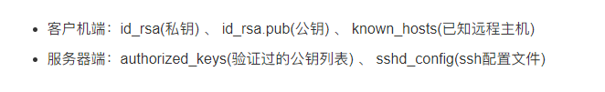

> \#Port 22
> \#port用来设置sshd监听的端口，为了安全起见，建议更改默认的22端口为5位以上陌生端口
>
> \#AddressFamily any
> \#指定运行时使用的协议簇：
> \#inet：使用 IPV4 协议簇，为默认值。
> \#inet6：使用 IPV6 协议簇。
> \#any：同时启用 IPV4 和 IPV6 协议簇。
>
> \#ListenAddress用来设置sshd服务器绑定的IP地址，不设置的话，默认预设所有接口均接受SSH
> \#ListenAddress 0.0.0.0
> \#ListenAddress ::
>
> \#sshd版本2
> \#Protocol 2   
>
> \#设置包含计算机私人密匙的文件
> HostKey /etc/ssh/ssh_host_rsa_key
> \#HostKey /etc/ssh/ssh_host_dsa_key
> HostKey /etc/ssh/ssh_host_ecdsa_key
> HostKey /etc/ssh/ssh_host_ed25519_key
>
> \#日志
> \# Logging
> \#SyslogFacilityAUTH
> SyslogFacilityAUTHPRIV  #日志Facility为AUTHPRIV
> \#LogLevel INFO      #日志级别
>
> \# Authentication:
> \#LoginGraceTime 2m  #表示认证的时限（以秒为单位）
> \#PermitRootLogin yes #root能不能用ssh登录
> \#StrictModes yes  #ssh在接收登录请求之前是否检查用户家目录和rhosts文件的权限和所有权
> \#MaxAuthTries 6     #只允许输错几回密码
> \#MaxSessions 10     #最大支持几个ssh会话
>
> \#密钥认证
> PubkeyAuthentication yes   #支持密钥的方式连接
> AuthorizedKeysFile    .ssh/authorized_keys   #密钥文件存放路径
>
> \#主机验证
> \#AuthorizedPrincipalsFile none
> \#AuthorizedKeysCommand none
> \#AuthorizedKeysCommandUser nobody
> \# For this to work you will also need host keys in /etc/ssh/ssh_known_hosts
> \#HostbasedAuthentication no
> \# Change to yes if you don't trust ~/.ssh/known_hosts for
> \# HostbasedAuthentication
> \#IgnoreUserKnownHostsyes
> \# Don't read theuser's ~/.rhosts and ~/.shosts files
> \#IgnoreRhosts yes
>
> \#口令验证
> \# To disabletunneled clear text passwords, change to no here!
> \#PasswordAuthentication no #是否开启身份验证
> \#PermitEmptyPasswords no  #是否允许用口令为空的帐号登录
> PasswordAuthentication no  #是否使用口令验证
>
> \#是否开启挑战响应身份验证
> \# Change to no todisable s/key passwords
> \#ChallengeResponseAuthenticationyes
> ChallengeResponseAuthenticationno
>
> \#Kerberos身份验证
> \# Kerberos options
> \#KerberosAuthentication no
> \#KerberosOrLocalPasswd yes
> \#KerberosTicketCleanup yes
> \#KerberosGetAFSToken no
> \#KerberosUseKuserok yes
>
> \#GSSAPI是公共安全事务应用程序接口(GSS-API)
> \#公共安全事务应用程序接口以一种统一的模式为使用者提供安全事务,由于它支持最基本的机制和技术,所以保证不同的应用环境下的可移植性.该规范定义了GSS-API事务和基本元素,并独立于基本的机制和程序设计语言环境,并借助于其它相关的文档规范实现.
> \# GSSAPI options
> GSSAPIAuthentication yes #是否允许使用基于GSSAPI 的用户认证.仅用于SSH-2
> GSSAPICleanupCredentials no #是否在用户退出登录后自动销毁用户凭证缓存。
> \#GSSAPIStrictAcceptorCheck yes
> \#GSSAPIKeyExchange no
> \#GSSAPIEnablek5users no
>
> \#SSH服务端的的PAM认证
>
> \# Set this to 'yes' to enable PAM authentication, account processing,
> \# and session processing. If this is enabled, PAM authentication will
> \# be allowed through the ChallengeResponseAuthentication and
> \# PasswordAuthentication. Depending on your PAM configuration,
> \# PAM authentication via ChallengeResponseAuthentication may bypass
> \# the setting of "PermitRootLogin without-password".
> \# If you just want the PAM account and session checks to run without
> \# PAM authentication, then enable this but set PasswordAuthentication
> \# and ChallengeResponseAuthentication to 'no'.
> \# WARNING: 'UsePAM no' is not supported in Red Hat Enterprise Linux and may cause several
> \# problems.
> UsePAM yes  #是否加载/etc/pam.d/sshd 
>
> \#转发
> \#AllowAgentForwarding yes
> \#如果采用本地转发方式,AllowTcpForwarding选项是no,则不允许转发.
> \#如果采用远程转发方式,AllowTcpForwarding选项是no,则不允许转发.
> \#AllowTcpForwarding yes
> \#远程主机连接本地转发端口
> \#GatewayPorts no #是否允许远程主机连接本地的转发端口
> \#X11转发允许在 SSH 客户端上显示应用程序的图形部分,而程序逻辑依然在远程服务器上执行.
> X11Forwarding yes
> \#X11DisplayOffset 10
> \#X11UseLocalhost yes
>
> \#允许或禁止登陆用户、组
> \#PermitTTY yes
> \#PrintMotd yes       #登录后显示/etc/motd中的信息
> \#PrintLastLog yes #成功登录后显示最后一位用户的登录信息
> TCPKeepAlive yes #是否持续发送tcp包，维持连接
> \#UseLogin no #是否使用ssh服务端的login程序进行登录验证
> \#UsePrivilegeSeparation sandbox #SSH服务端通过创建非特权子进程处理接入请求的方法来进行权限分离
> \#PermitUserEnvironment no
> \#Compressiondelayed  #压缩选项yes
> \#连接超时断开连接
> \#ClientAliveInterval 0  #设置一个以秒记的时长,如果超过这么长时间没有收到客户端的任何数据,sshd 将通过安全通道向客户端发送一个"alive"消息,并等候应答.
> \#ClientAliveCountMax3   #sshd在未收到任何客户端回应前最多允许发送多少个"alive"消息,到达这个上限后,sshd 将强制断开连接,关闭会话
> \#ShowPatchLevel no   #在连接ssh端口时,是否返回SSH的补丁版本信息
> \#UseDNS yes  #是否对远程主机名进行反向解析,以检查此主机名是否与其IP地址真实对应.
> \#PidFile/var/run/sshd.pid   #pid文件存放位置
> \#这个选项一定要配合LoginGraceTime选项一起使用.
> \#MaxStartups10:30:100 #允许有多少次验证连接请求
> \#PermitTunnel no
> \#ChrootDirectory none
> \#VersionAddendum none
>
> \# no defaultbanner path
>
> \#Banner none #登录之前显示在用户屏幕上,后面跟着文件位置
>
> \#指定客户端发送的哪些环境变量将会被传递到会话环境中
> \# Accept locale-related environment variables
> AcceptEnv LANG LC_CTYPE LC_NUMERIC LC_TIME LC_COLLATE LC_MONETARY LC_MESSAGES
> AcceptEnv LC_PAPER LC_NAME LC_ADDRESS LC_TELEPHONE LC_MEASUREMENT
> AcceptEnv LC_IDENTIFICATION LC_ALL LANGUAGE
> AcceptEnv XMODIFIERS
>
> \#配置一个外部的子系统,仅用于SSH-V2协议,一般这里使用sftp
> \# override defaultof no subsystems
> Subsystem   sftp /usr/libexec/openssh/sftp-server
>
> \# Example of overriding settings on a per-user basis
> \#Match User anoncvs
> \# X11Forwarding no
> \# AllowTcpForwarding no
> \# PermitTTY no
> \# ForceCommand cvs server

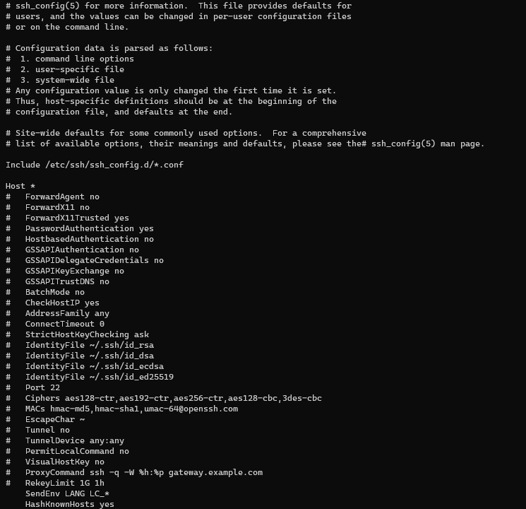

---

#### 实战练习

##### 一.口令验证（实现设备之间的登录）

###### 电脑连接手机的termux

电脑端：

1. 创建私钥(id_rsa):

命令：ssh-keygen 


2. 选择密钥：

* 公钥 [id_rsa.pub]：

发给服务端

复制 id_rsa.pub文件的内容给termux


* 私钥：

留在客户端

手机端：

1. 同样是生成公钥密钥：


2. 开启服务端sshd:


3. 创建authorized_keys:

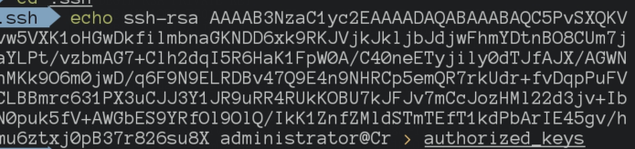

> 这一步可以使用，也可以不使用，使用后可以避免每次输入密码

4. **注意事项：**

​	需要注意termux第一次一定要设置密码，否则会导致无法连接

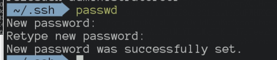

5. 获取局域网的 ip 地址和用户名：

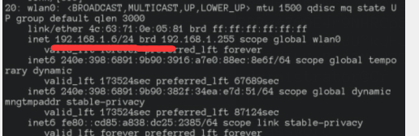


发送给电脑

再回到电脑端进行连接

1. 输入连接命令：

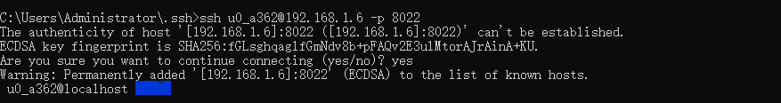

2. 然后直接连接成功了，这是因为我们交出了公钥

3. exit退出连接

##### 二. 电脑连接电脑（条件不足，无法演示，主要是买不起服务器/(ㄒoㄒ)/~~）

---

### 开始Git 旅行✈！！！

Ok,我们已经有了前面的知识储备，让我们开始下一步吧👌


>  [Git 官方教程](https://git-scm.com/book/zh/v2)

#### git的抽象概念


Git 是一个很重要的版本控制工具，就相当于我们所用的ctrl z，一样的重要，但是一个非常大的项目，我们不可能对他进行全部的监控，就相当于我们编辑文件是写的一个，那么这一部分处于编辑软件的监控，这就对应着git 中的git add （暂存区）,然后再大一个仓库，对应到版本区，版本区，也就是当年修订好，决定保存下来之后，帮你存下这些最终的保存文件，让你以后可以撤销之前的修改。

拿office 中的 Excel 来举个栗子：

1. 进入工作区，准备开始工作


2. 点击空白工作薄，就相当于git add 

3. 输入类容，发生修改，并且保存，这就相当于是git commit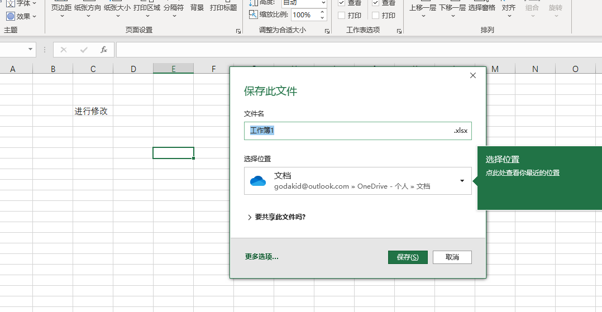

4. 以及这个最近，就相当于git log 的功能


以上均是指在本地的git ，之后会介绍与github的联合使用

#### 获得Git

```json
{
"main-web-site":"https://git-scm.com/downloads" 
}
```


> 如果你是Ubuntu 一切就会变得很简单 ，只需要在命令行输入sudo apt install git， 就可以完成安装
>
> 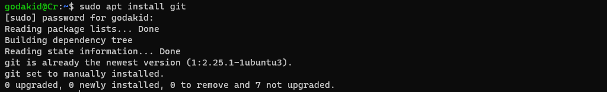
>
> Windows就麻烦一些，需要下载安装包，进行安装，这里就暂时不过多介绍，直接一路回车就行

#### 创建本地仓库

1. 点击鼠标右键，点击Git bash here

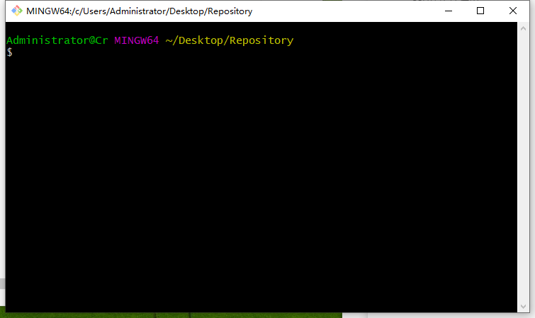

> 你也可以打开cmd，使用git 命令

2. 创建一个文件夹，这里我就直接在桌面创建，并且进入文件夹中

```powershell
mkdir Repository
cd Repository
```


3. git init 进行初始化

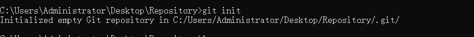

dir /a 可以看到多了一个.git文件夹，这可以表示我们已经创建成功了

> 其实这个文件夹放置了，需要的一些配置，已经用于记录版本差异的地方。这里暂时不做过多解释

```powershell
git init
dir /a
```

4. 你可以把你的项目拷贝到本地仓库中

5. git add [路径名 / 文件名]把文件/文件夹放到暂存区中

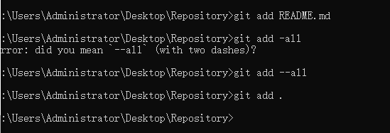

> git status 可以查看状态
>
> 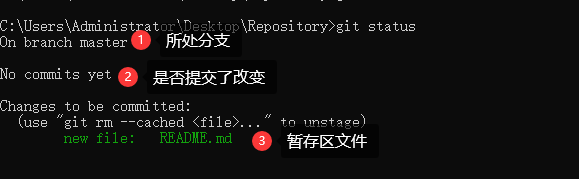

6. 比如这里进行一下简单的修改

> 用git status 查看效果

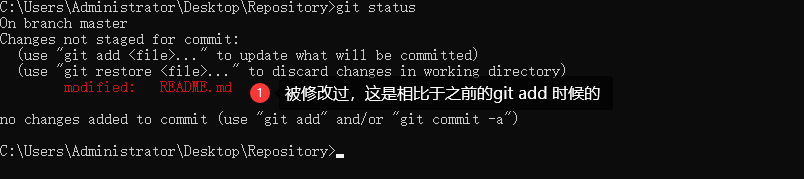

7. git commit -m “[Description]”提交修改

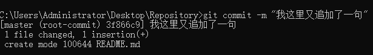

> 这是作为相较于最后一次的，然后输入git log 可以查看记录
>
> 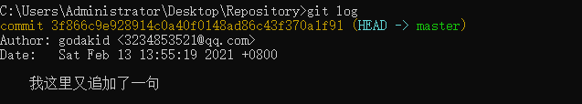

#### 回退版本
现在，你已经学会了修改文件，然后把修改提交到Git版本库，现在，再练习一次，修改README.md文件如下：
```markdown
# HelloWorld！！！.
我这里又追加了一句.
```
然后尝试提交：
```powershell
git add README.md
git commit -m "我这里又追加了一句"
```
像这样，你不断对文件进行修改，然后不断提交修改到版本库里，就好比玩游戏时，每通过一关就会自动把游戏状态存盘，如果某一关没过去，你还可以选择读取前一关的状态。有些时候，在打Boss之前，你会手动存盘，以便手残败了了，可以从最近的地方重新开始。Git也是一样，每当你觉得文件修改到一定程度的时候[git add 中]，就可以“存档”，这个存档在Git中被称为`commit`。一旦你把文件改乱了，或者误删了文件，还可以从最近的一个`commit`恢复，然后继续工作。    
现在，我们回顾一下`README.md`文件一共有几个版本被提交到Git仓库里了：

版本1：创建一个文件
```markdown
# HelloWorld！！！.
```
版本2：添加了一句
```markdown
# HelloWorld！！！.
我这里又追加了一句.
```
版本3：不小心覆盖了【或者错误了】

```markdown
I am wrong (Π~Π)
```
当然了，在实际工作中，我们脑子里怎么可能记得一个几千行的文件每次都改了什么内容，不然要版本控制系统干什么。版本控制系统肯定有某个命令可以告诉我们历史记录，在Git中，我们用`git log`命令查看：
```powershell
commit a9bc3c8d70e1a7de2360963ef976a80c4eb19406 (HEAD -> master)
Author: godakid <3234853521@qq.com>
Date:   Sat Feb 13 14:23:18 2021 +0800

I am wrong (Π~Π)

commit fd5023c25f63d7c55f766ab423ca064e809e0fab
Author: godakid <3234853521@qq.com>
Date:   Sat Feb 13 14:22:22 2021 +0800

这里追加了一句，作为版本v0.0.2

commit 87bbfe26a41d8ebcc5a7431ec613a225f8db103f
Author: godakid <3234853521@qq.com>
Date:   Sat Feb 13 14:20:32 2021 +0800

创建了第一个文件，作为版本v0.0.1

```
`git log`命令显示从最近到最远的提交日志，我们可以看到3次提交，最近的一次是`I am wrong (Π~Π)`，上一次是`这里追加了一句，作为版本v0.0.2`，最早的一次是`创建了第一个文件，作为版本v0.0.1`。
如果嫌输出信息太多，看得眼花缭乱的，可以试试加上`--pretty=oneline`参数：
```powershell
git log --pretty=oneline
a9bc3c8d70e1a7de2360963ef976a80c4eb19406 (HEAD -> master) I am wrong (Π~Π)
fd5023c25f63d7c55f766ab423ca064e809e0fab 这里追加了一句，作为版本v0.0.2
87bbfe26a41d8ebcc5a7431ec613a225f8db103f 创建了第一个文件，作为版本v0.0.1
```

需要友情提示的是，你看到的一大串类似`a9bc3c...`的是`commit id`（版本号），和SVN不一样，Git的`commit id`不是1，2，3……递增的数字，而是一个SHA1计算出来的一个非常大的数字，用十六进制表示，而且你看到的`commit id`和我的肯定不一样，以你自己的为准。为什么`commit id`需要用这么一大串数字表示呢？因为Git是分布式的版本控制系统，后面我们还要研究多人在同一个版本库里工作，如果大家都用1，2，3……作为版本号，那肯定就冲突了。

**好了，我们刚才也把文件修改了，可是现在如果我们想要变回去该怎么办呢？**
首先，Git必须知道当前版本是哪个版本，在Git中，用`HEAD`表示当前版本，也就是最新的提交`a9bc3c...`（注意我的提交ID和你的肯定不一样），上一个版本就是`HEAD^`，上上一个版本就是`HEAD^^`，当然往上100个版本写100个`^`比较容易数不过来，所以写成`HEAD~100`。
现在，我们要把当前版本`I am wrong (Π~Π)`回退到上一个版本`v0.0.2，就可以使用`git reset`命令：
```
git reset --hard HEAD~
HEAD is now at 87bbfe2 创建了第一个文件，作为版本v0.0.1
```

`--hard`参数有啥意义？这个后面再讲，现在你先放心使用。

看看`README.md`的内容是不是版本 `V0.0.1`：

```
$ TYPE README.md
...
...

```

果然被还原了。

还可以继续回退到上一个版本`v0.0.1`，不过且慢，让我们用`git log`再看看现在版本库的状态：

最新的那个版本`v0.0.1`已经看不到了！好比你从21世纪坐时光穿梭机来到了19世纪，想再回去已经回不去了.

办法其实还是有的，只要上面的命令行窗口还没有被关掉，你就可以顺着往上找啊找啊，找到那个`v0.0.1`的`commit id`是`87bbfe...`，于是就可以指定回到未来的某个版本：

```
$ git reset --hard 87bbfe..
HEAD is now at 87bbfe 创建了第一个文件，作为版本v0.0.1
```

版本号没必要写全，前几位就可以了，Git会自动去找。当然也不能只写前一两位，因为Git可能会找到多个版本号，就无法确定是哪一个了。

再小心翼翼地看看`README.md`的内容：

```
$ type README.md
....
....
```

果然，又回来了。

Git的版本回退速度非常快，因为Git在内部有个指向当前版本的`HEAD`指针，当你回退版本的时候，Git仅仅是把HEAD从指向`v0.0.1`：

```ascii
┌────┐
│HEAD│
└────┘
│
└──> ○ 创建了第一个文件，作为版本v0.0.1
│
○ 这里追加了一句，作为版本v0.0.2
│
○ I am wrong (Π~Π)
```

改为指向`创建了第一个文件，作为版本v0.0.1`：

```ascii
┌────┐
│HEAD│
└────┘
│
│    ○ 创建了第一个文件，作为版本v0.0.1
│    │
└──> ○ 这里追加了一句，作为版本v0.0.2
│
○ I am wrong (Π~Π)
```

然后顺便把工作区的文件更新了。所以你让`HEAD`指向哪个版本号，你就把当前版本定位在哪。

现在，你回退到了某个版本，关掉了电脑，第二天早上就后悔了，想恢复到新版本怎么办？找不到新版本的`commit id`怎么办？

在Git中，总是有后悔药可以吃的。当你用`$ git reset --hard HEAD^`回退到`v0.0.1`版本时，再想恢复到`v0.0.2`，就必须找到`v0.0.1`的commit id。Git提供了一个命令`git reflog`用来记录你的每一次命令：

```
$ git reflog
e475afc HEAD@{1}: reset: moving to HEAD^
1094adb (HEAD -> master) HEAD@{2}: commit: append GPL
e475afc HEAD@{3}: commit: add distributed
eaadf4e HEAD@{4}: commit (initial): wrote a readme file
```

终于舒了口气，从输出可知，`v0.0.1`的commit id是`87bbf..`，现在，你又可以乘坐时光机回到未来了

#### Git 分支 - 分支简介

> 这里是Git 的官方介绍，个人认为官方的就已经很详细了

---


​        

几乎所有的版本控制系统都以某种形式支持分支。 使用分支意味着你可以把你的工作从开发主线上分离开来，以免影响开发主线。 在很多版本控制系统中，这是一个略微低效的过程——常常需要完全创建一个源代码目录的副本。对于大项目来说，这样的过程会耗费很多时间。

有人把 Git 的分支模型称为它的“必杀技特性”，也正因为这一特性，使得 Git 从众多版本控制系统中脱颖而出。 为何 Git 的分支模型如此出众呢？ Git 处理分支的方式可谓是难以置信的轻量，创建新分支这一操作几乎能在瞬间完成，并且在不同分支之间的切换操作也是一样便捷。 与许多其它版本控制系统不同，Git 鼓励在工作流程中频繁地使用分支与合并，哪怕一天之内进行许多次。 理解和精通这一特性，你便会意识到 Git 是如此的强大而又独特，并且从此真正改变你的开发方式。

#### 分支简介

为了真正理解 Git 处理分支的方式，我们需要回顾一下 Git 是如何保存数据的。

或许你还记得 [起步](https://git-scm.com/book/zh/v2/ch00/ch01-getting-started) 的内容， Git 保存的不是文件的变化或者差异，而是一系列不同时刻的 **快照** 。

在进行提交操作时，Git 会保存一个提交对象（commit object）。 知道了 Git 保存数据的方式，我们可以很自然的想到——该提交对象会包含一个指向暂存内容快照的指针。 但不仅仅是这样，该提交对象还包含了作者的姓名和邮箱、提交时输入的信息以及指向它的父对象的指针。 首次提交产生的提交对象没有父对象，普通提交操作产生的提交对象有一个父对象， 而由多个分支合并产生的提交对象有多个父对象，

为了更加形象地说明，我们假设现在有一个工作目录，里面包含了三个将要被暂存和提交的文件。 暂存操作会为每一个文件计算校验和（使用我们在 [起步](https://git-scm.com/book/zh/v2/ch00/ch01-getting-started) 中提到的 SHA-1 哈希算法），然后会把当前版本的文件快照保存到 Git 仓库中 （Git 使用 *blob* 对象来保存它们），最终将校验和加入到暂存区域等待提交：

```console
$ git add README test.rb LICENSE
$ git commit -m 'The initial commit of my project'
```

当使用 `git commit` 进行提交操作时，Git 会先计算每一个子目录（本例中只有项目根目录）的校验和， 然后在 Git 仓库中这些校验和保存为树对象。随后，Git 便会创建一个提交对象， 它除了包含上面提到的那些信息外，还包含指向这个树对象（项目根目录）的指针。 如此一来，Git 就可以在需要的时候重现此次保存的快照。

现在，Git 仓库中有五个对象：三个 *blob* 对象（保存着文件快照）、一个 **树** 对象 （记录着目录结构和 blob 对象索引）以及一个 **提交** 对象（包含着指向前述树对象的指针和所有提交信息）。


Figure 9. 首次提交对象及其树结构

做些修改后再次提交，那么这次产生的提交对象会包含一个指向上次提交对象（父对象）的指针。


Figure 10. 提交对象及其父对象

Git 的分支，其实本质上仅仅是指向提交对象的可变指针。 Git 的默认分支名字是 `master`。 在多次提交操作之后，你其实已经有一个指向最后那个提交对象的 `master` 分支。 `master` 分支会在每次提交时自动向前移动。

> Note  
> Git 的 `master` 分支并不是一个特殊分支。 它就跟其它分支完全没有区别。 之所以几乎每一个仓库都有 master 分支，是因为 `git init` 命令默认创建它，并且大多数人都懒得去改动它。 


Figure 11. 分支及其提交历史

#### 分支创建

Git 是怎么创建新分支的呢？ 很简单，它只是为你创建了一个可以移动的新的指针。 比如，创建一个 testing 分支， 你需要使用 `git branch` 命令：

```console
$ git branch testing
```

这会在当前所在的提交对象上创建一个指针。


Figure 12. 两个指向相同提交历史的分支

那么，Git 又是怎么知道当前在哪一个分支上呢？ 也很简单，它有一个名为 `HEAD` 的特殊指针。 请注意它和许多其它版本控制系统（如 Subversion 或 CVS）里的 `HEAD` 概念完全不同。 在 Git 中，它是一个指针，指向当前所在的本地分支（译注：将 `HEAD` 想象为当前分支的别名）。 在本例中，你仍然在 `master` 分支上。 因为 `git branch` 命令仅仅 **创建** 一个新分支，并不会自动切换到新分支中去。


Figure 13. HEAD 指向当前所在的分支

你可以简单地使用 `git log` 命令查看各个分支当前所指的对象。 提供这一功能的参数是 `--decorate`。

```console
$ git log --oneline --decorate
f30ab (HEAD -> master, testing) add feature #32 - ability to add new formats to the central interface
34ac2 Fixed bug #1328 - stack overflow under certain conditions
98ca9 The initial commit of my project
```

正如你所见，当前 `master` 和 `testing` 分支均指向校验和以 `f30ab` 开头的提交对象。

#### 分支切换

要切换到一个已存在的分支，你需要使用 `git checkout` 命令。 我们现在切换到新创建的 `testing` 分支去：

```console
$ git checkout testing
```

这样 `HEAD` 就指向 `testing` 分支了。


Figure 14. HEAD 指向当前所在的分支

那么，这样的实现方式会给我们带来什么好处呢？ 现在不妨再提交一次：

```console
$ vim test.rb
$ git commit -a -m 'made a change'
```


#### Git 分支 - 分支的新建与合并

##### 分支的新建与合并

让我们来看一个简单的分支新建与分支合并的例子，实际工作中你可能会用到类似的工作流。 你将经历如下步骤：

1. 开发某个网站。
2. 为实现某个新的用户需求，创建一个分支。
3. 在这个分支上开展工作。

正在此时，你突然接到一个电话说有个很严重的问题需要紧急修补。 你将按照如下方式来处理：

1. 切换到你的线上分支（production branch）。
2. 为这个紧急任务新建一个分支，并在其中修复它。
3. 在测试通过之后，切换回线上分支，然后合并这个修补分支，最后将改动推送到线上分支。
4. 切换回你最初工作的分支上，继续工作。

##### 新建分支

首先，我们假设你正在你的项目上工作，并且在 `master` 分支上已经有了一些提交。


Figure 18. 一个简单提交历史

现在，你已经决定要解决你的公司使用的问题追踪系统中的 #53 问题。 想要新建一个分支并同时切换到那个分支上，你可以运行一个带有 `-b` 参数的 `git checkout` 命令：

```console
$ git checkout -b iss53
Switched to a new branch "iss53"
```

它是下面两条命令的简写：

```console
$ git branch iss53
$ git checkout iss53
```


Figure 19. 创建一个新分支指针

你继续在 #53 问题上工作，并且做了一些提交。 在此过程中，`iss53` 分支在不断的向前推进，因为你已经检出到该分支 （也就是说，你的 `HEAD` 指针指向了 `iss53` 分支）

```console
$ vim index.html
$ git commit -a -m 'added a new footer [issue 53]'
```


Figure 20. `iss53` 分支随着工作的进展向前推进

现在你接到那个电话，有个紧急问题等待你来解决。 有了 Git 的帮助，你不必把这个紧急问题和 `iss53` 的修改混在一起， 你也不需要花大力气来还原关于 53# 问题的修改，然后再添加关于这个紧急问题的修改，最后将这个修改提交到线上分支。 你所要做的仅仅是切换回 `master` 分支。

但是，在你这么做之前，要留意你的工作目录和暂存区里那些还没有被提交的修改， 它可能会和你即将检出的分支产生冲突从而阻止 Git 切换到该分支。 最好的方法是，在你切换分支之前，保持好一个干净的状态。 有一些方法可以绕过这个问题（即，暂存（stashing） 和 修补提交（commit amending））， 我们会在 [贮藏与清理](https://git-scm.com/book/zh/v2/ch00/_git_stashing) 中看到关于这两个命令的介绍。 现在，我们假设你已经把你的修改全部提交了，这时你可以切换回 `master` 分支了：

```console
$ git checkout master
Switched to branch 'master'
```

这个时候，你的工作目录和你在开始 #53 问题之前一模一样，现在你可以专心修复紧急问题了。 请牢记：当你切换分支的时候，Git 会重置你的工作目录，使其看起来像回到了你在那个分支上最后一次提交的样子。 Git 会自动添加、删除、修改文件以确保此时你的工作目录和这个分支最后一次提交时的样子一模一样。

接下来，你要修复这个紧急问题。 我们来建立一个 `hotfix` 分支，在该分支上工作直到问题解决：

```console
$ git checkout -b hotfix
Switched to a new branch 'hotfix'
$ vim index.html
$ git commit -a -m 'fixed the broken email address'
[hotfix 1fb7853] fixed the broken email address
1 file changed, 2 insertions(+)
```


Figure 21. 基于 `master` 分支的紧急问题分支 `hotfix branch`

你可以运行你的测试，确保你的修改是正确的，然后将 `hotfix` 分支合并回你的 `master` 分支来部署到线上。 你可以使用 `git merge` 命令来达到上述目的：

```console
$ git checkout master
$ git merge hotfix
Updating f42c576..3a0874c
Fast-forward
index.html | 2 ++
1 file changed, 2 insertions(+)
```

在合并的时候，你应该注意到了“快进（fast-forward）”这个词。 由于你想要合并的分支 `hotfix` 所指向的提交 `C4` 是你所在的提交 `C2` 的直接后继， 因此 Git 会直接将指针向前移动。换句话说，当你试图合并两个分支时， 如果顺着一个分支走下去能够到达另一个分支，那么 Git 在合并两者的时候， 只会简单的将指针向前推进（指针右移），因为这种情况下的合并操作没有需要解决的分歧——这就叫做 “快进（fast-forward）”。

现在，最新的修改已经在 `master` 分支所指向的提交快照中，你可以着手发布该修复了。


Figure 22. `master` 被快进到 `hotfix`

关于这个紧急问题的解决方案发布之后，你准备回到被打断之前时的工作中。 然而，你应该先删除 `hotfix` 分支，因为你已经不再需要它了 —— `master` 分支已经指向了同一个位置。 你可以使用带 `-d` 选项的 `git branch` 命令来删除分支：

```console
$ git branch -d hotfix
Deleted branch hotfix (3a0874c).
```

现在你可以切换回你正在工作的分支继续你的工作，也就是针对 #53 问题的那个分支（iss53 分支）。

```console
$ git checkout iss53
Switched to branch "iss53"
$ vim index.html
$ git commit -a -m 'finished the new footer [issue 53]'
[iss53 ad82d7a] finished the new footer [issue 53]
1 file changed, 1 insertion(+)
```


Figure 23. 继续在 `iss53` 分支上的工作

你在 `hotfix` 分支上所做的工作并没有包含到 `iss53` 分支中。 如果你需要拉取 `hotfix` 所做的修改，你可以使用 `git merge master` 命令将 `master` 分支合并入 `iss53` 分支，或者你也可以等到 `iss53` 分支完成其使命，再将其合并回 `master` 分支。

##### 分支的合并

假设你已经修正了 #53 问题，并且打算将你的工作合并入 `master` 分支。 为此，你需要合并 `iss53` 分支到 `master` 分支，这和之前你合并 `hotfix` 分支所做的工作差不多。 你只需要检出到你想合并入的分支，然后运行 `git merge` 命令：

```console
$ git checkout master
Switched to branch 'master'
$ git merge iss53
Merge made by the 'recursive' strategy.
index.html |    1 +
1 file changed, 1 insertion(+)
```

这和你之前合并 `hotfix` 分支的时候看起来有一点不一样。 在这种情况下，你的开发历史从一个更早的地方开始分叉开来（diverged）。 因为，`master` 分支所在提交并不是 `iss53` 分支所在提交的直接祖先，Git 不得不做一些额外的工作。 出现这种情况的时候，Git 会使用两个分支的末端所指的快照（`C4` 和 `C5`）以及这两个分支的公共祖先（`C2`），做一个简单的三方合并。


Figure 24. 一次典型合并中所用到的三个快照

和之前将分支指针向前推进所不同的是，Git 将此次三方合并的结果做了一个新的快照并且自动创建一个新的提交指向它。 这个被称作一次合并提交，它的特别之处在于他有不止一个父提交。


Figure 25. 一个合并提交

既然你的修改已经合并进来了，就不再需要 `iss53` 分支了。 现在你可以在任务追踪系统中关闭此项任务，并删除这个分支。

```console
$ git branch -d iss53
```

##### 遇到冲突时的分支合并

有时候合并操作不会如此顺利。 如果你在两个不同的分支中，对同一个文件的同一个部分进行了不同的修改，Git 就没法干净的合并它们。 如果你对 #53 问题的修改和有关 `hotfix` 分支的修改都涉及到同一个文件的同一处，在合并它们的时候就会产生合并冲突：

```console
$ git merge iss53
Auto-merging index.html
CONFLICT (content): Merge conflict in index.html
Automatic merge failed; fix conflicts and then commit the result.
```

此时 Git 做了合并，但是没有自动地创建一个新的合并提交。 Git 会暂停下来，等待你去解决合并产生的冲突。 你可以在合并冲突后的任意时刻使用 `git status` 命令来查看那些因包含合并冲突而处于未合并（unmerged）状态的文件：

```console
$ git status
On branch master
You have unmerged paths.
(fix conflicts and run "git commit")

Unmerged paths:
(use "git add <file>..." to mark resolution)

both modified:      index.html

no changes added to commit (use "git add" and/or "git commit -a")
```

任何因包含合并冲突而有待解决的文件，都会以未合并状态标识出来。 Git 会在有冲突的文件中加入标准的冲突解决标记，这样你可以打开这些包含冲突的文件然后手动解决冲突。 出现冲突的文件会包含一些特殊区段，看起来像下面这个样子：

```html
<<<<<<< HEAD:index.html
<div id="footer">contact : email.support@github.com</div>
=======
<div id="footer">
please contact us at support@github.com
</div>
>>>>>>> iss53:index.html
```

这表示 `HEAD` 所指示的版本（也就是你的 `master` 分支所在的位置，因为你在运行 merge 命令的时候已经检出到了这个分支）在这个区段的上半部分（`=======` 的上半部分），而 `iss53` 分支所指示的版本在 `=======` 的下半部分。 为了解决冲突，你必须选择使用由 `=======` 分割的两部分中的一个，或者你也可以自行合并这些内容。 例如，你可以通过把这段内容换成下面的样子来解决冲突：

```html
<div id="footer">
please contact us at email.support@github.com
</div>
```

上述的冲突解决方案仅保留了其中一个分支的修改，并且 `<<<<<<<` , `=======` , 和 `>>>>>>>` 这些行被完全删除了。 在你解决了所有文件里的冲突之后，对每个文件使用 `git add` 命令来将其标记为冲突已解决。 一旦暂存这些原本有冲突的文件，Git 就会将它们标记为冲突已解决。

如果你想使用图形化工具来解决冲突，你可以运行 `git mergetool`，该命令会为你启动一个合适的可视化合并工具，并带领你一步一步解决这些冲突：

```console
$ git mergetool

This message is displayed because 'merge.tool' is not configured.
See 'git mergetool --tool-help' or 'git help config' for more details.
'git mergetool' will now attempt to use one of the following tools:
opendiff kdiff3 tkdiff xxdiff meld tortoisemerge gvimdiff diffuse diffmerge ecmerge p4merge araxis bc3 codecompare vimdiff emerge
Merging:
index.html

Normal merge conflict for 'index.html':
{local}: modified file
{remote}: modified file
Hit return to start merge resolution tool (opendiff):
```

如果你想使用除默认工具（在这里 Git 使用 `opendiff` 做为默认的合并工具，因为作者在 Mac 上运行该程序） 外的其他合并工具，你可以在 “下列工具中（one of the following tools）” 这句后面看到所有支持的合并工具。 然后输入你喜欢的工具名字就可以了。

| Note | 如果你需要更加高级的工具来解决复杂的合并冲突，我们会在 [高级合并](https://git-scm.com/book/zh/v2/ch00/_advanced_merging) 介绍更多关于分支合并的内容。 |
| ---- | ------------------------------------------------------------ |
|      |                                                              |

等你退出合并工具之后，Git 会询问刚才的合并是否成功。 如果你回答是，Git 会暂存那些文件以表明冲突已解决： 你可以再次运行 `git status` 来确认所有的合并冲突都已被解决：

```console
$ git status
On branch master
All conflicts fixed but you are still merging.
(use "git commit" to conclude merge)

Changes to be committed:

modified:   index.html
```

如果你对结果感到满意，并且确定之前有冲突的的文件都已经暂存了，这时你可以输入 `git commit` 来完成合并提交。 默认情况下提交信息看起来像下面这个样子：

```console
Merge branch 'iss53'
Conflicts:
index.html
#
# It looks like you may be committing a merge.
# If this is not correct, please remove the file
#	.git/MERGE_HEAD
# and try again.
# Please enter the commit message for your changes. Lines starting
​        # with '#' will be ignored, and an empty message aborts the commit.
​        # On branch master
​        # All conflicts fixed but you are still merging.
​        #
​        # Changes to be committed:
​        #	modified:   index.html
​        #
​        ```
​    
​        如果你觉得上述的信息不够充分，不能完全体现分支合并的过程，你可以修改上述信息， 添加一些细节给未来检视这个合并的读者一些帮助，告诉他们你是如何解决合并冲突的，以及理由是什么。
​    

# Git 分支 - 分支管理

## 分支管理

现在已经创建、合并、删除了一些分支，让我们看看一些常用的分支管理工具。

`git branch` 命令不只是可以创建与删除分支。 如果不加任何参数运行它，会得到当前所有分支的一个列表：

​```console
$ git branch
iss53
* master
testing
```

注意 `master` 分支前的 `*` 字符：它代表现在检出的那一个分支（也就是说，当前 `HEAD` 指针所指向的分支）。 这意味着如果在这时候提交，`master` 分支将会随着新的工作向前移动。 如果需要查看每一个分支的最后一次提交，可以运行 `git branch -v` 命令：

```console
$ git branch -v
iss53   93b412c fix javascript issue
* master  7a98805 Merge branch 'iss53'
testing 782fd34 add scott to the author list in the readmes
```

`--merged` 与 `--no-merged` 这两个有用的选项可以过滤这个列表中已经合并或尚未合并到当前分支的分支。 如果要查看哪些分支已经合并到当前分支，可以运行 `git branch --merged`：

```console
$ git branch --merged
iss53
* master
```

因为之前已经合并了 `iss53` 分支，所以现在看到它在列表中。 在这个列表中分支名字前没有 `*` 号的分支通常可以使用 `git branch -d` 删除掉；你已经将它们的工作整合到了另一个分支，所以并不会失去任何东西。

查看所有包含未合并工作的分支，可以运行 `git branch --no-merged`：

```console
$ git branch --no-merged
testing
```

这里显示了其他分支。 因为它包含了还未合并的工作，尝试使用 `git branch -d` 命令删除它时会失败：

```console
$ git branch -d testing
error: The branch 'testing' is not fully merged.
If you are sure you want to delete it, run 'git branch -D testing'.
```

如果真的想要删除分支并丢掉那些工作，如同帮助信息里所指出的，可以使用 `-D` 选项强制删除它。


​        

### GitHub 与Git联动

#### 📋首先你得有个账号

```json
{
"main-web-site":"https://github.com/",
"addition-web-site":"https://gitee.com/",
"helper-site":"https://seo.chinaz.com/"
}
```

1. 打开Github官网


点击 `Sign up` 进行注册 ，这里就不过多介绍了  🚀🚀🚀🚀加速.加速...


#### 📋让GitHub 认识我们的主机

登录账号，紧跟我的步伐 🏃

1. 点击头像 >>Setting >>SSH and GPG keys


​       

​        

​        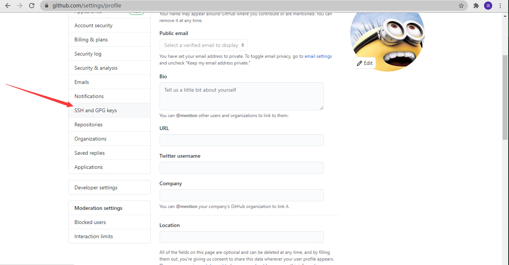

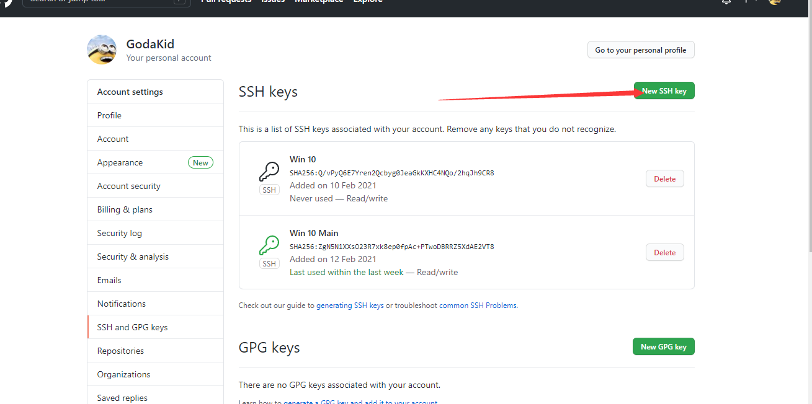

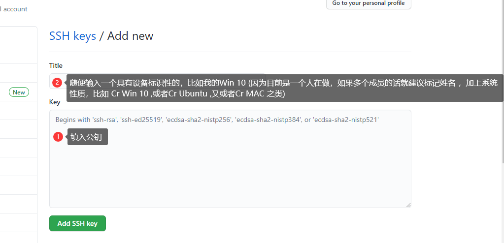

> 其实从这里可以看出GitHub 就相当于作为个远程的服务器，这里就是相当于填写了authorize_hosts , 当然Git其实和GitHub是不一样的，Git全面来讲是他的版本控制能力，这里的GitHub只是为我们提供了一个免费的仓库。

---

#### 📋建立远程仓库(repository)

1. 回到主页，点击Repositories

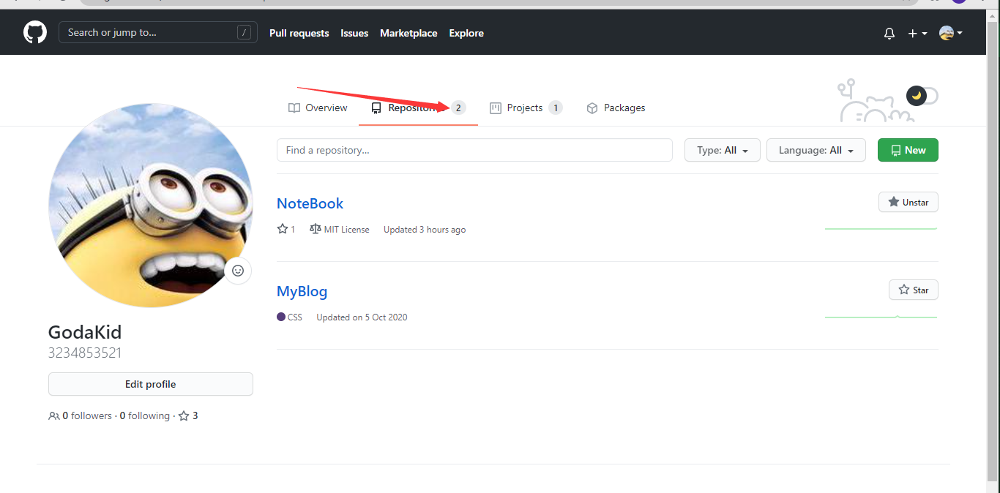

2. 点击New 添加新的仓库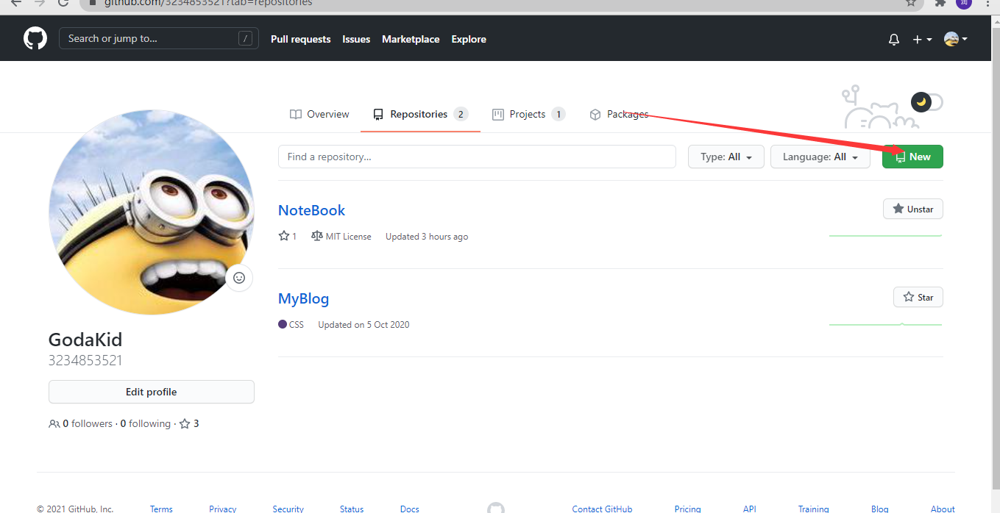

3. 设置基本信息（我这里就不再创建了）

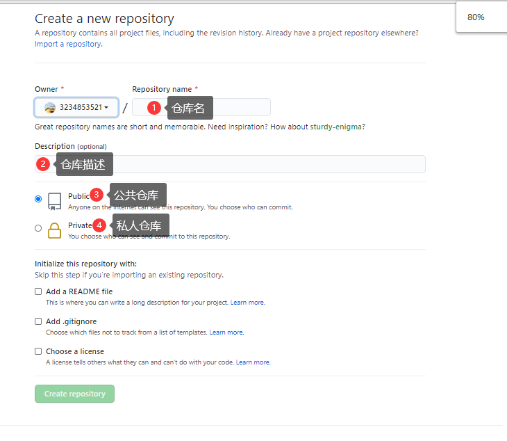

4. 我这里选取之前的NoteBook仓库，进行介绍

5. 得到远程仓库地址（这个需要记下）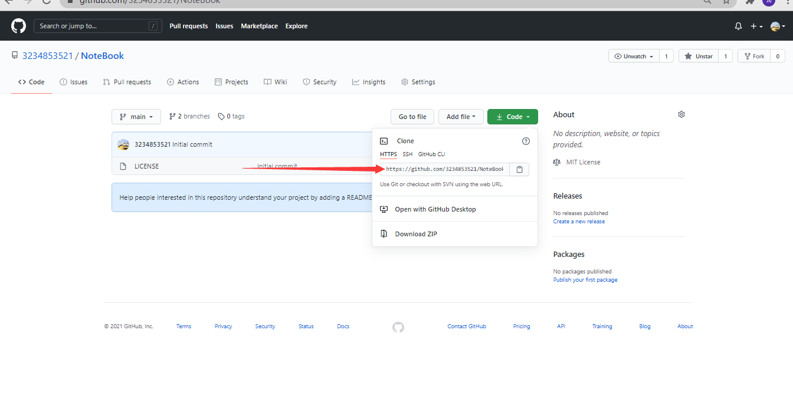

# 等待更新。。。。


