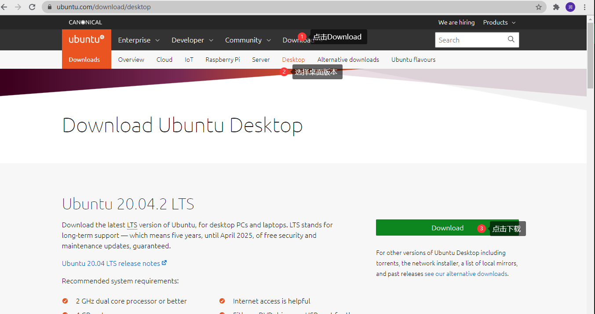
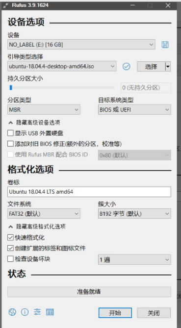
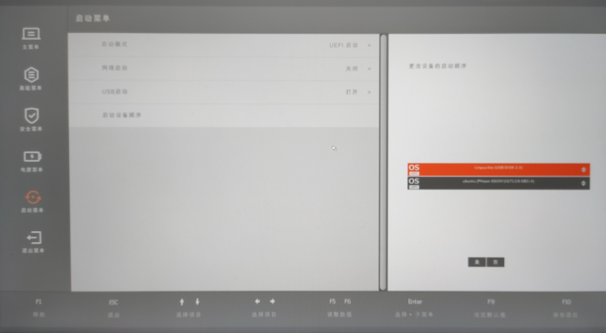
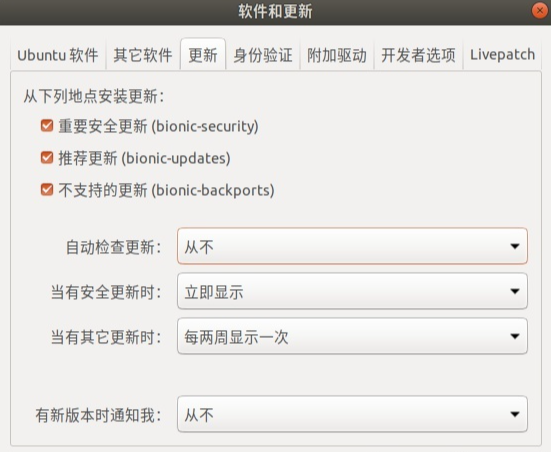
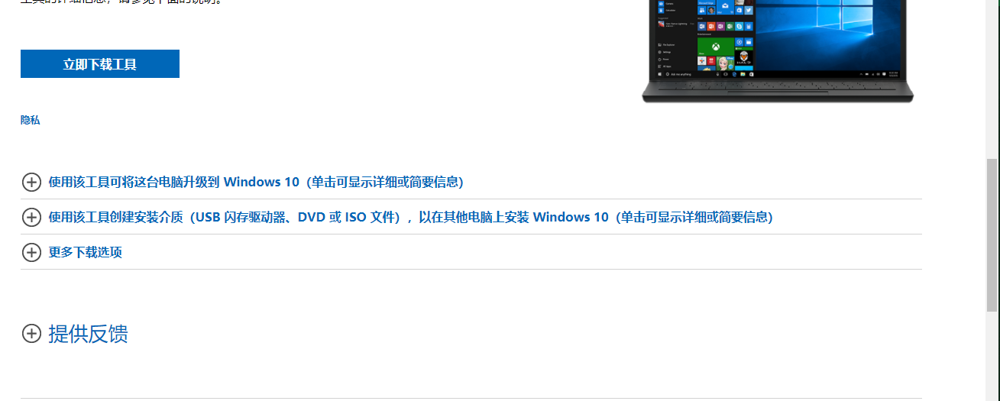
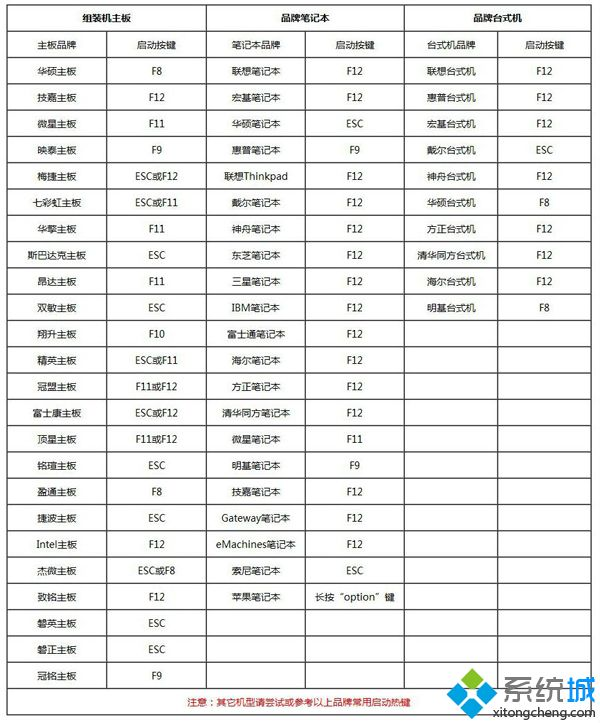
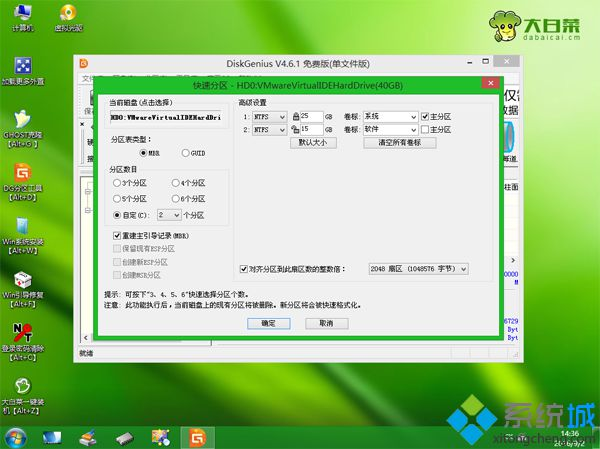
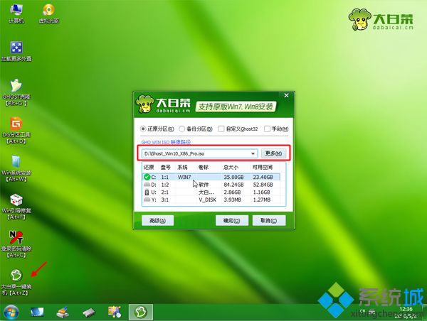

3. ## 重装系统的记录

   ### 重装系统的情况
   
   1. WIN 10 转为 Ubuntu
   2. Ubuntu 转为 WIN 10（或者电脑问题需要重装）
   3. WIN 10 转 WIN 其他
   
   #### WIN 10 转为 Ubuntu
   
   ##### 所需要的工具：
   
   ```json
   {	"硬件工具":"大于16G的U盘",
       "refus":"https://rufus.ie/",
       "Ubuntu":"https://ubuntu.com/download"
   }
   ```
   
   ##### 具体细节：
   
   1. Ubuntu镜像下载界面：
   
       2021年推荐使用20.18 LTS 
   
   
   
   2. U 盘启动器制作：
   
       按如下配置安装。
   
       引导类型选择 点“选择”，然后点你上面下载的iso文件；分区类型 +目标系统类型就选MBR+BIOS或UEFI（我选过GPT+UEFI在grub界面有误）；文件系统这个也是选默认FAT32+8192的就行。
   
       点开始。
   
       
   
       点开始之后选择以ISO镜像写入（ISO和DD镜像方式都出现过问题）：
   
       等待10分钟左右，ubuntu启动盘就制作完成了。
   
   3. 安装
   
       关于引导方式：Legacy或者UEFI引导都可以。我的小米笔记本支持UEFI引导，但是我的dell主机只能用Legacy。
   
       在安装的时候，顺序如下：
   
       1. 插入启动盘。
       2. 进入BIOS，（如果电脑能够识别USB装置）。
       3. 调整启动顺序，把USB启动那一项调至最高，保存重启。
       4. 在grub界面中选择第二项Install Ubuntu。
   
       
   
       进入ubuntu安装程序之后，如果没有什么特殊的需求，选择默认设置正常安装就行。第一次安装的同学建议安装English系统。有安装经验，碰到稀奇的坑不怕重装折腾的话，建议安中文系统，因为可以省去复杂的中文输入法安装。
   
       如果你有特殊的分区需求（比如有两个硬盘，想把硬盘都完全格式化并重新“分区”），可以参考我的以下分区配置。
   
       PS：尤其是原来系统是win10并确定要装单ubuntu系统的同学，建议把win10盘里面所有的文件（包括grub）删除干净，否则有可能因为grub冲突进不去新装的系统。
   
   4. 分区
   
   我的分区策略如下：
   
   ​	第一，需要给/root文件夹分配200MB的空间。第二，没有使用服务器的需求，不分配交换空间。第三，给根目录/分配200G的空间。第四，给用户文件夹/home（而不是/usr，/usr里面的文件的读写都是需要权限的）分配剩下的970G空间。（/home里的文件就是“主目录”“照片”“文档”“下载”之类的最常用的目录，因此分配了尽量多的空间。）
   
   ​	第一，第二都是逻辑分区，第三，第四都是主分区。文件系统选项都是默认的EXT4文件系统。
   
   ​	5.  安装完成后
   
   ​	在ubuntu系统安装完成后，其他的东西你都可以自己捣鼓，但是有一个建议是绝对有用的：
   
   不要更新
   
   
   
   更新之后系统有可能直接进不去，亲测。
   
   不用把“从下列地点安装更新”的三个勾去掉，去掉之后apt和apt-get会有问题。
   
   之后ubuntu每一次提醒你更新都点取消就行。
   
   #### Ubuntu 转为 WIN 10（或者电脑问题需要重装）
   
   ##### 所需要的工具：
   
   ```json
   {	"硬件工具":"4G及以上U盘一个，制作U盘PE启动盘",
       "WIN 10 ISO":"https://www.microsoft.com/zh-cn/software-download/windows10",
   }
   ```
   
   ##### 具体细节
   
   由于Ubuntu下不适合安装U盘启动器，太复杂了，所以建议制作U盘启动器制作
   
   如果确实没办法，可以参考https://blog.csdn.net/lym152898/article/details/72858617
   
   1. 下载安装WIN ISO
   
   
   
   2. 制作U盘启动器
   
   3. 进入PE
   
       
   
   4. 分区：
   
       分区部分特别注意，经常出现安装半天之后发现自己白装了，极大的可能就是逻辑分区搞错了
   
       **mbr分区安装win10注意事项**
   
       1、当分区为MBR分区时，bios必须是legacy引导，要一一对应：legacy+mbr或uefi+gpt。
   
       2、win10 32位只能legacy+mbr模式安装，win10 64位可以uefi+gpt安装，也可以legacy+mbr安装。
   
       3、一般情况2016以前的电脑采用的mbr分区比较多，2016年以后大部分电脑都采用uefi+gpt方式安装，注意要用mbr分区安装win10需要注意在bios中设置legacy引导。
   
       4、戴尔2018年以后电脑不支持legacy引导，需要采用uefi+gpt。
   
       5、如果是近两年的新电脑，硬盘采用的nvme协议的m.2固态硬盘需要采用uefi+gpt方式安装。
   
       
   
       ​	这里，分区表类型选择MBR，然后设置分区数目和分区大小，系统盘建议50G或更大，如果是固态硬盘，勾选“对齐分区到此扇区的整数倍”，默认的2048扇区即可4k对齐，点击确定执行分区过程；
   
   
   
   6、双击打开【大白菜一键装机】，映像路径选择win10 iso镜像，此时工具会自动提取gho文件，点击下拉框，选择win10.gho文件；
   
   
   
   **mbr分区安装win10注意事项****：**  
   
   1、当分区为MBR分区时，bios必须是legacy引导，要一一对应：legacy+mbr或uefi+gpt。
   
   2、win10 32位只能legacy+mbr模式安装，win10 64位可以uefi+gpt安装，也可以legacy+mbr安装。
   
   3、一般情况2016以前的电脑采用的mbr分区比较多，2016年以后大部分电脑都采用uefi+gpt方式安装，注意要用mbr分区安装win10需要注意在bios中设置legacy引导。
   
   4、戴尔2018年以后电脑不支持legacy引导，需要采用uefi+gpt。
   
   5、如果是近两年的新电脑，硬盘采用的nvme协议的m.2固态硬盘需要采用uefi+gpt方式安装。
   
   
   
   #### WIN 10 转为 WIN　其他
   
   这种情况下推荐有两个步骤：
   
   １.　下载市面的在线重装软件(选其一)：
   
   ```json
   {
       "黑鲨重装":"https://www.heisha.net/",
       "小白重装":"http://www.xiaobaixitong.com/"
   }
   ```
   
   2. 安装后傻瓜式操作
   
   3. 安装成功后建议激活后二次重装，就是利用系统自带的恢复工具，进行二次洗礼，这样可以避免三方软件带来的一些没必要的移植
   
        
   
   